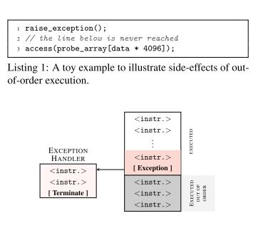
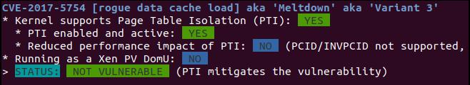
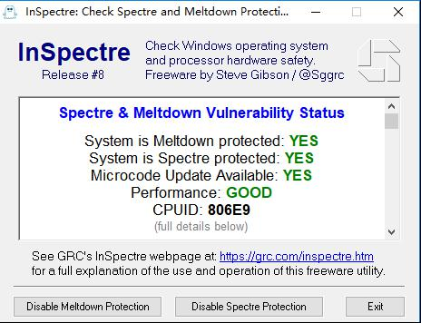

# Meltdown Prove of Concept
## 原理
### 乱序执行
为了提高指令执行效率与速度, 常使用流水线技术, 多条指令一起执行. 进一步地, 指令在分解为微操作后, 会在一定程度内乱序执行. 表现为后面的执行先于前面的执行
### 临界指令
如下, 图片来自<sup>[1]</sup>



当出现异常时, 就陷入内核, 解决异常, 在正常情况下, 对于没有权限的用户程序, 后面的 `access` 指令是不会执行的. 可是由于前面提到的特性, 那些指令还是会和 raise_exception 中一些步骤一起执行.
只不过后来发现异常, 就舍弃了. 但是仍然存在于 cache 中.
### 访问 cache
所以可以利用 cache 来得到后面的指令访问的非法地址的数据, 一种方法就是 `flush + reload`  
就是通过多次访问 cache, 比较访问的时间, 如果 cache 命中, 则这个访问时间短于 未命中的情况. 最后就可以将命中的 cache 中的内容保存下来


## 过程
### 实验环境
* cpu 信息
```
vendor_id       : GenuineIntel
cpu family      : 6
model           : 142
model name      : Intel(R) Core(TM) i7-7500U CPU @ 2.70GHz
stepping        : 9
microcode       : 0xffffffff
cpu MHz         : 2901.000
cache size      : 256 KB
```
* 在 虚拟机上, ubuntu 17.04

### 检查 meltdown 补丁
使用[spectre-meltdown-checker](https://github.com/speed47/spectre-meltdown-checker.git)检查是否有 meltdown 补丁

结果是有



### 关闭 meltdown 补丁
使用 [inSpectre](https://grc.com/inspectre.htm) 可以关闭,如下



### 运行
```shell
sudo ./do.sh
```
结果
```
cached = 34, uncached = 281, threshold 93
read ffffffffa3e000a0 = 25 %
read ffffffffa3e000a1 = 73 s
read ffffffffa3e000a2 = 20  
read ffffffffa3e000a3 = 76 v
read ffffffffa3e000a4 = 65 e
read ffffffffa3e000a5 = 72 r
read ffffffffa3e000a6 = 73 s
read ffffffffa3e000a7 = 69 i
read ffffffffa3e000a8 = 6f o
read ffffffffa3e000a9 = 6e n
VULNERABLE ON
return code: 0
rm -f meltdown.o meltdown rdtscp.h

```
## 参考
1.  [Meltdown by Lipp, Schwarz, Gruss, Prescher, Haas, Mangard, Kocher, Genkin, Yarom, and Hamburg](https://meltdownattack.com/meltdown.pdf)
2.  [paboldin/meltdown-exploit](https://github.com/paboldin/meltdown-exploit)
3.  [GCC 内联汇编基础](https://www.jianshu.com/p/1782e14a0766)
